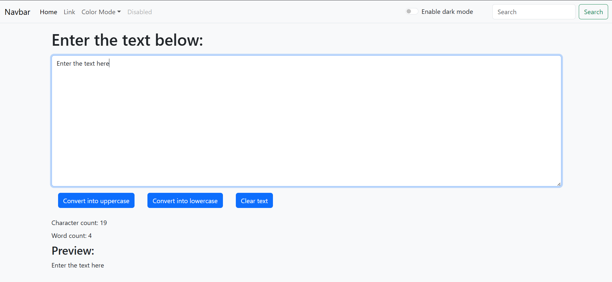

<h1 align="center">📝 Text Utility App</h1>

  A sleek, lightweight React app that lets you transform and analyze text in real-time.  
  Built with 💙 using React, JavaScript, HTML, and CSS.

  
  
  

---

## ✨ Features

- 🔠 **Convert to Uppercase**
- 🔡 **Convert to Lowercase**
- 🔢 **Real-time Word & Character Count**
- 🧹 **Clear Text Instantly**
- 🌓 **Toggle Dark / Light Mode**
- 📱 **Responsive Design**

---

## 🎥 Preview

> *(Optional: Add a screenshot or GIF preview here)*  
> 

---

## 📁 Tech Stack

- ⚛️ **React** – UI framework  
- 🧠 **JavaScript** – App logic  
- 🎨 **CSS3** – Styling  
- 🧱 **HTML5** – Structure  
- 📦 **Bootstrap** – Responsive components and styling

---

## 🚀 Live Demo

🌐 (https://text-omega-two.vercel.app/)

---

## 📌 Author

**Daksh Agarwal**  
🔗 [GitHub](https://github.com/dakshagarwal76)

---

## 📜 License

This project is open source and free to use for learning and development.

